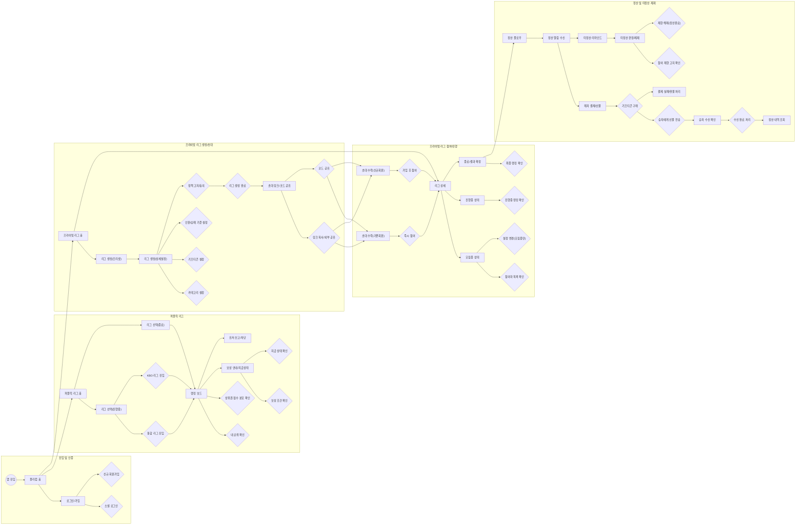

```mermaid
flowchart LR

  subgraph s1 ["진입 및 인증"]
    n1(("앱 진입"))
    n2["폴리컵 홈"]
    n3["로그인/가입"]
    n4{"소셜 로그인"}
    n5{"신규 회원가입"}
  end

  subgraph s2 ["퍼블릭 리그"]
    n6["퍼블릭 리그 홈"]
    n7["리그 선택(진행중)"]
    n8["리그 선택(종료)"]
    n9{"통합 리그 진입"}
    n10{"KBO 리그 진입"}
    n11["랭킹 보드"]
    n12{"내 순위 확인"}
    n13{"상위권 점수 분포 확인"}
    n14["보상 안내/지급상태"]
    n15{"보상 조건 확인"}
    n16{"지급 상태 확인"}
    n17["유저 신고/차단"]
  end

  subgraph s3 ["프라이빗 리그 생성/초대"]
    n18["프라이빗 리그 홈"]
    n19["리그 생성(프리셋)"]
    n20["리그 생성(상세설정)"]
    n21{"카테고리 설정"}
    n22{"기프티콘 설정"}
    n23{"인원/승패 기준 설정"}
    n24{"정책 고지/동의"}
    n25{"리그 생성 완료"}
    n26["초대 링크/코드 공유"]
    n27{"링크 복사/외부 공유"}
    n28{"코드 공유"}
  end

  subgraph s4 ["프라이빗 리그 참여/진행"]
    n29["초대 수락(기존회원)"]
    n30["초대 수락(신규회원)"]
    n31{"즉시 참여"}
    n32{"가입 후 참여"}
    n33["리그 상세"]
    n34["모집중 상태"]
    n35["진행중 상태"]
    n36["종료/결과 확정"]
    n37{"참여자 목록 확인"}
    n38{"진행중 랭킹 확인"}
    n39{"최종 랭킹 확인"}
    n40{"설정 변경(모집중만)"}
  end

  subgraph s5 ["정산 및 미정산 제재"]
    n41["정산 플로우"]
    n42["정산 알림 수신"]
    n43["패자 결제/선물"]
    n44{"기프티콘 구매"}
    n45{"승자에게 선물 전송"}
    n46["승자 수신 확인"]
    n47{"수신 완료 처리"}
    n48["정산 내역 조회"]
    n49["미정산 리마인드"]
    n50["미정산 판정/제재"]
    n51{"참여 제한 고지 확인"}
    n52{"제한 해제(정산완료)"}
    n53["결제 실패/환불 처리"]
  end

  n1 --> n2
  n2 --> n3
  n3 --> n4
  n3 --> n5
  n2 --> n6
  n2 --> n18
  n6 --> n7
  n6 --> n8
  n7 --> n9
  n7 --> n10
  n9 --> n11
  n10 --> n11
  n8 --> n11
  n11 --> n12
  n11 --> n13
  n11 --> n14
  n14 --> n15
  n14 --> n16
  n11 --> n17
  n18 --> n19
  n19 --> n20
  n20 --> n21
  n20 --> n22
  n20 --> n23
  n20 --> n24
  n24 --> n25
  n25 --> n26
  n26 --> n27
  n26 --> n28
  n27 --> n29
  n27 --> n30
  n28 --> n29
  n28 --> n30
  n29 --> n31
  n30 --> n32
  n31 --> n33
  n32 --> n33
  n33 --> n34
  n33 --> n35
  n33 --> n36
  n34 --> n37
  n34 --> n40
  n35 --> n38
  n36 --> n39
  n36 --> n41
  n41 --> n42
  n42 --> n43
  n43 --> n44
  n44 --> n45
  n45 --> n46
  n46 --> n47
  n47 --> n48
  n42 --> n49
  n49 --> n50
  n50 --> n51
  n50 --> n52
  n44 --> n53
  n18 --> n33
```
